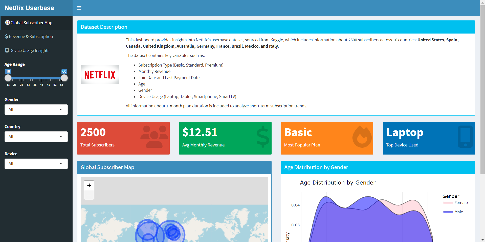
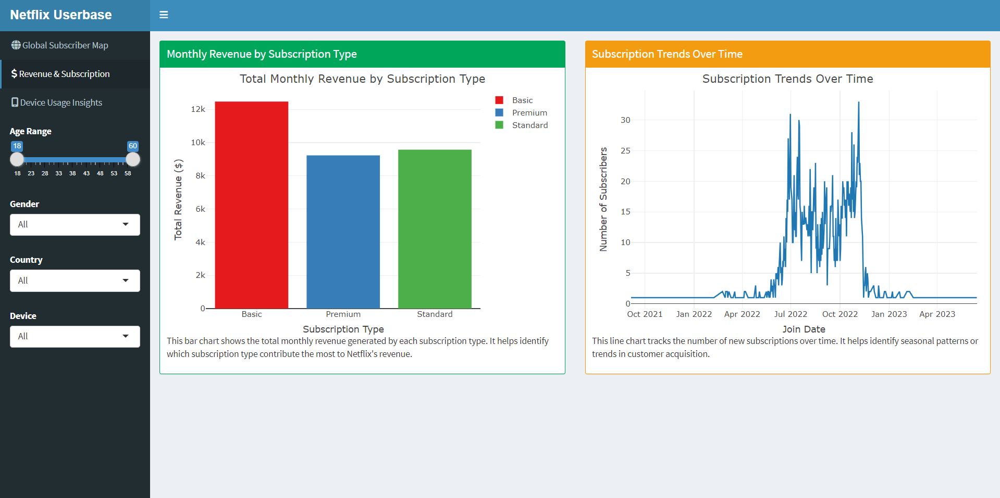
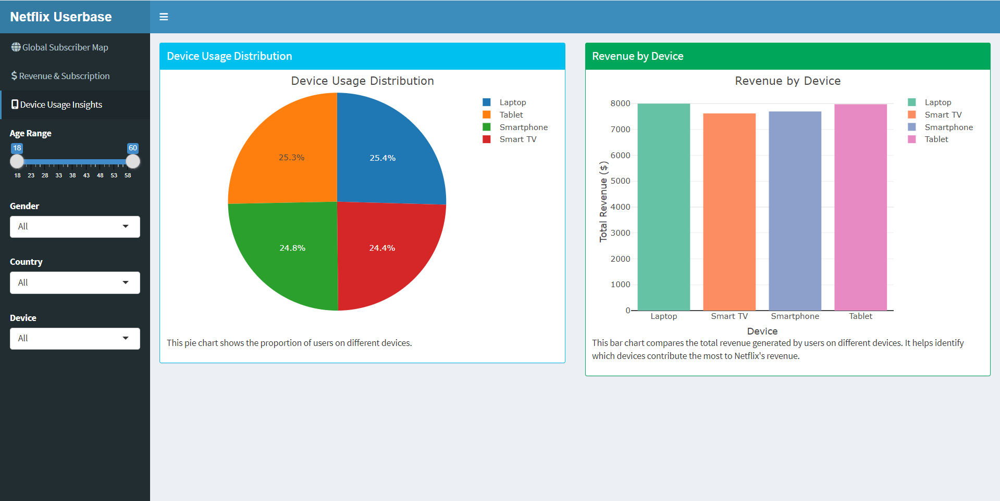

# Netflix Userbase Analytics Dashboard - README

## 📊 Overview
This Shiny dashboard provides interactive visualizations of Netflix subscriber data across 10 countries. The application allows users to explore subscriber demographics, revenue patterns, and device usage through dynamic filters and interactive charts.

Here’s a preview of the dashboard:

## 🛠 Features

### 1. 🌍 **Global Subscriber Map**
- Interactive **Leaflet** map showing subscriber distribution by country.
- Country markers sized by subscriber count.
- Tooltips with detailed metrics (average age, predominant subscription type).
- Geographic visualization of Netflix's user base.

### 2. 🔧 **Dynamic Dashboard Filters**
- **Age range slider** (25-55 years).
- **Gender selection** (Male/Female/All).
- **Country selector** (10 available countries).
- **Device type filter** (Smartphone, Tablet, etc.).
- All visualizations update in real-time based on filter selections.

### 3. 📈 **Key Performance Indicators**
- Real-time metrics displayed in value boxes:
  - Total subscribers
  - Average monthly revenue
  - Most popular subscription plan
  - Top device used

### 4. 💰 **Revenue & Subscription Analytics**
- Monthly revenue by subscription type (Basic/Standard/Premium).
- **Subscription trends** over time (time-series visualization).
- **Revenue comparison** across different subscription plans.

### 5. 📱 **Device Usage Insights**
- **Pie chart** showing device distribution.
- Revenue contribution by device type.
- Comparison of user preferences across devices.

## 🧑‍💻 Technical Implementation

### 📚 **Libraries Used**
- `shiny`: Core framework for building the web application.
- `shinydashboard`: Provides the dashboard layout and UI components.
- `leaflet`: Interactive map visualization.
- `plotly`: Interactive charts and graphs.
- `dplyr`: Data manipulation and transformation.
- `ggplot2`: Base plotting system for visualizations.

### 🧹 **Data Processing**
- Dataset cleaned using **Python** prior to R analysis.
- **Country coordinates** added via lookup table for mapping.
- **Reactive data filtering** enables dynamic updates.
- **Grouped aggregations** for country-level and device-level metrics.

### 🎯 **Key Skills Demonstrated**
1. Interactive mapping with **Leaflet**.
2. **Reactive programming** in Shiny.
3. **Data wrangling** with `dplyr`.
4. Visualization with **ggplot2** and **Plotly**.
5. **Dashboard UI design** with **shinydashboard**.
6. **Time-series data visualization**.
7. Dynamic filtering and real-time updates.

## 📝 How to Use
1. Adjust filters in the sidebar to focus on specific demographics.
2. Explore the map by hovering/clicking on country markers.
3. Switch between tabs to view different analytical perspectives.
4. Interact with charts by hovering for details.

## 📊 Data Source
The dataset was sourced from Kaggle and contains information about 2,500 Netflix subscribers across 10 countries:

You can access the dataset [here on Kaggle](https://www.kaggle.com/datasets/riturajsingh99/netflix-userbase).

## ⚙️ Requirements
To run this application, you'll need:
- **R** (version 4.0 or higher)
- **RStudio** (recommended)
- The following R packages:
  - shiny
  - shinydashboard
  - leaflet
  - plotly
  - dplyr
  - ggplot2

## 👩‍💻 Author

**Weerappulige Sadini Thiranja - BSc (Hons) in Data Science, University of Colombo, Sri Lanka**  
Data enthusiast passionate about applying analytics to real-world problems.  
[Connect with me on LinkedIn](https://www.linkedin.com/in/sadini-thiranja-b028662a1/)

---

📌 *This dashboard is for educational and research purposes only.*
